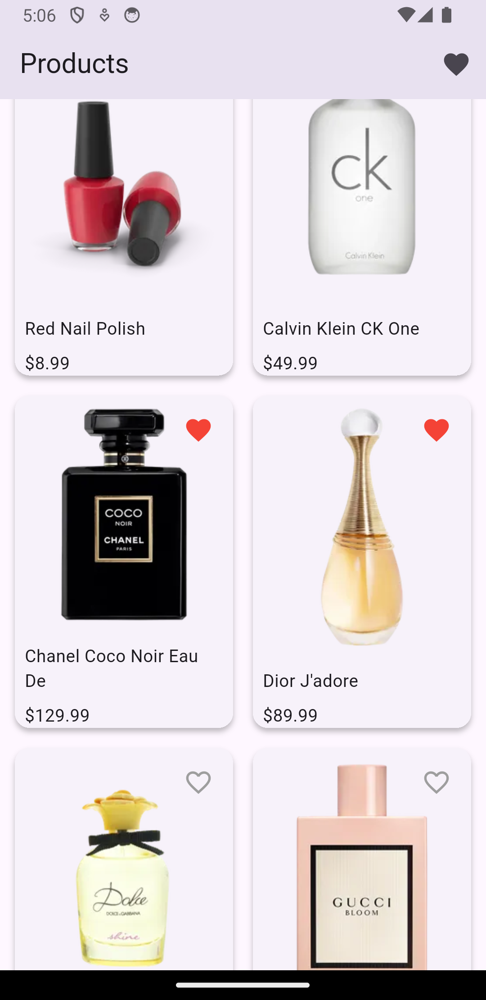
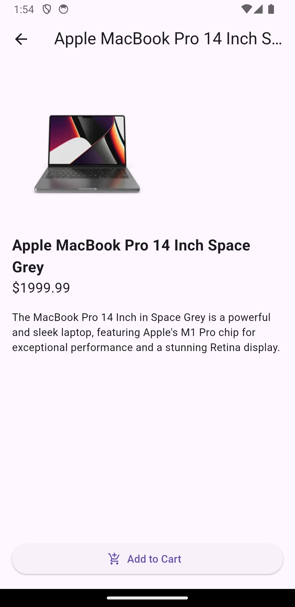
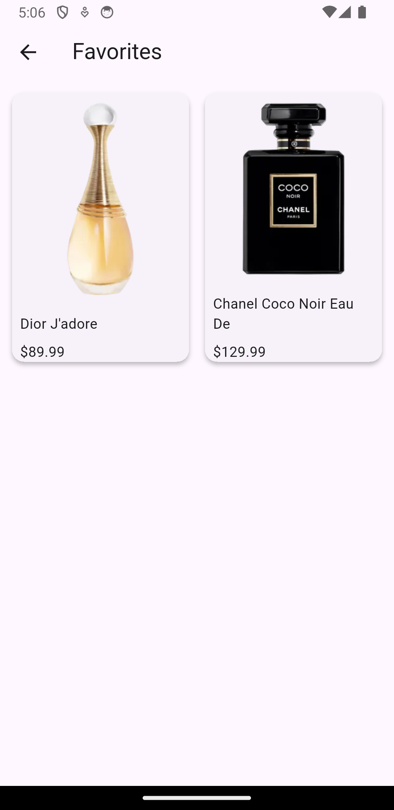
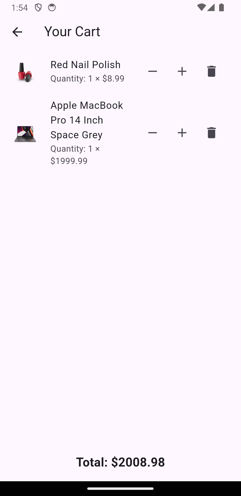
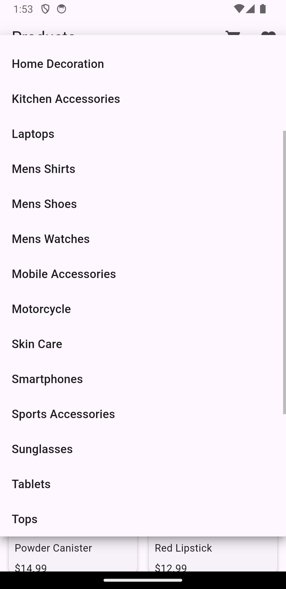
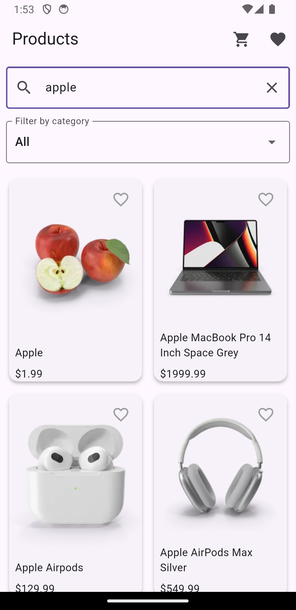

# 🛒 Flutter Shopping App (DummyJSON API)

A sample Flutter shopping app using BLoC & HydratedBLoC for state management. Built with clean architecture practices and real-time API data from [DummyJSON](https://dummyjson.com/products). Supports:

- Infinite scroll (pagination)
- Product detail screen
- Add/remove favorites (wishlist)
- Favorites persisted with HydratedBLoC

## 🚀 Features

- 📦 Product list with pagination (`limit` + `skip`) using `HydratedBloc`
- 🔎 Product search by Name, Category
- ❤️ Wishlist (Favorites) using `HydratedBloc`
- 🛒 Add to Cart and Basket Management using `HydratedBloc`
- 🧾 Product details page
- 🧪 Clean and modular BLoC pattern
- 🧼 Error handling, loading indicators
- 🔄 State persistence across app restarts
- ⛓️‍💥 Support offline for product text and images using `cached_network_image`


## 🧱 Architecture

This project follows a clean and modular architecture:

- **Presentation Layer**: UI widgets and screens using Flutter
- **BLoC Layer**: Business logic and state management using `flutter_bloc` and `hydrated_bloc`
- **Data Layer**: Repository pattern to abstract API calls
- **Models**: Strongly typed Dart models for product, category, cart item, etc.


### 📁 Folder Structure

```
lib/
├── blocs/         # BLoC files (product, cart, favorites, category)
│   ├── cart/      # CartBloc, CartEvent, CartState
│   ├── category/  # CategoryBloc, CategoryEvent, CategoryState
│   ├── favorites/ # FavoritesBloc, FavoritesEvent, FavoritesState
│   └── product/   # ProductBloc, ProductEvent, ProductState
│
├── models/        # Dart models (Product, Category, CartItem, etc.)
│
├── repository/    # API and data fetching logic
│   ├── product_repository.dart
│   └── category_repository.dart
│
├── screens/       # UI Screens (ProductList, Cart, Favorites, ProductDetails)
│
├── widgets/       # Reusable UI components (e.g. ProductCard, etc.)
│
└── main.dart      # App entry point
```


### 📦 Packages Used

| Package                | Description                                                                 |
|------------------------|-----------------------------------------------------------------------------|
| `flutter_bloc`         | State management using the BLoC pattern                                     |
| `hydrated_bloc`        | BLoC with automatic state persistence (local storage)                       |
| `path_provider`        | Used by `hydrated_bloc` to access local file storage for state persistence |
| `equatable`            | Simplifies value comparisons in BLoC events and states                      |
| `connectivity_plus`    | Checks internet connectivity status                                         |
| `cached_network_image` | Efficient image loading and caching (useful for offline support)            |
| `cupertino_icons`      | iOS-style icons                                                             |


## 🛠️ Setup

```bash
git clone https://github.com/your-username/flutter-shopping-app-dummyjson-bloc.git
cd flutter-shopping-app-dummyjson-bloc
flutter pub get
flutter run
```


## 📷 Screenshots

| Product List | Product Detail | Favorites |
|--------------|----------------|-----------|
|  |  |  |


| Basket | Category Filter | Keyword Search |
|------|------------------|--------|
|  |  |  |

---

🌐 API Reference
Uses DummyJSON for product data.

Example endpoints:

https://dummyjson.com/products?limit=6&skip=0

https://dummyjson.com/products/1

---


